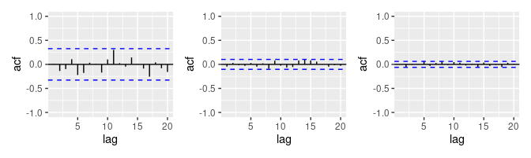

```{r setup, include=FALSE}
knitr::opts_chunk$set(echo = TRUE)
library(corrplot)
library(caret)
library(tidyr)
library(dplyr)
library(mice)
library(kableExtra)
library(mlbench)
library(forecast)
library(fpp3)
library(DT)
library(feasts)
library(seasonal)
library(tsibble)
library(lubridate)
```

### Exercise 9.1
Figure 9.32 shows the ACFs for 36 random numbers, 360 random numbers and 1,000 random numbers.




**(a) Explain the differences among these figures. Do they all indicate that the data are white noise**?

As the number of random numbers increases, the ACF boundaries become narrower. Each of the above ACF plots tell us that the data are white noise because over 95% of the lag data for each chart fall within the ACF boundaries.  

**(b) Why are the critical values at different distances from the mean of zero? Why are the autocorrelations different in each figure when they each refer to white noise**? 

The critical values are at different distances from the mean of zero due to the law of large numbers. As the number of observations increase, the number of outliers from the mean decreases. Additionally, the autocorrelations are different in each figure due to the fact that the series are composed of random numbers. As a result, the autocorrelations will also show signs of randomness.

\ 

### Exercise 9.2
A classic example of a non-stationary series are stock prices. Plot the daily closing prices for Amazon stock (contained in gafa_stock), along with the ACF and PACF. Explain how each plot shows that the series is non-stationary and should be differenced.

```{r 9.2, eval=TRUE, message=FALSE, warning=FALSE}
ggtsdisplay(gafa_stock$Close)
acf_results <- acf(gafa_stock$Close, plot = FALSE)
acf_results
```

The above ACF plot shows us that the autocorrelation values decrease over time (_we can confirm this observation by looking at the results of calling the acf() function on the data_). Both the ACF and PACF plots seem to display seasonality and most of the lags fall outside of the boundaries suggesting that the data is not white noise. Additionally, the series graph shows an upward trend in the data, followed by a sharp drop, and then a continued upward trend further suggesting that this is a non-stationary series.

\ 

### Exercise 9.3
For the following series, find an appropriate Box-Cox transformation and order of differencing in order to obtain stationary data.


**(a) Turkish GDP from _global_economy_**.

```{r 9.3A, eval=TRUE, message=FALSE, warning=FALSE}
# Extract Turkish GDP data from the global_economy dataset.
turkishGDP <- global_economy %>% filter(Country == 'Turkey')
ggtsdisplay(turkishGDP$GDP)

# BoxCox and difference the data.
BoxCoxedData <- BoxCox(turkishGDP$GDP, lambda = BoxCox.lambda(turkishGDP$GDP))
DifferencedData <- diff(BoxCoxedData)

# Explore the data after BoxCoxing and differencing to check for improvement.
ggtsdisplay(DifferencedData)
```


**(b) Accommodation takings in the state of Tasmania from _aus_accommodation_**.

```{r 9.3B, eval=TRUE, message=FALSE, warning=FALSE}
# Extract Tasmania Accomodation Takings data from the aus_accommodation dataset.
tasmaniaAccomodationTakings <- aus_accommodation %>% filter(State == 'Tasmania')

# Explore the data before BoxCoxing and differencing.
ggtsdisplay(tasmaniaAccomodationTakings$Takings)

# BoxCox and difference the data.
TasmaniaBoxCoxedData <- BoxCox(tasmaniaAccomodationTakings$Takings, lambda = BoxCox.lambda(tasmaniaAccomodationTakings$Takings))
TasmaniaDifferencedData <- diff(TasmaniaBoxCoxedData)

# Explore the data after BoxCoxing and differencing to check for improvement.
ggtsdisplay(TasmaniaDifferencedData)
```


**(c) Monthly sales from _souvenirs_**.

```{r 9.3C, eval=TRUE, message=FALSE, warning=FALSE}
# Extract the sales data from the souvenirs dataset.
souvenirSales <- souvenirs$Sales

# Explore the data before BoxCoxing and differencing.
ggtsdisplay(souvenirSales)

# BoxCox and difference the data.
SalesBoxCoxedData <- BoxCox(souvenirSales, lambda = BoxCox.lambda(souvenirSales))
SalesDifferencedData <- diff(SalesBoxCoxedData)

# Explore the data after BoxCoxing and differencing to check for improvement.
ggtsdisplay(SalesDifferencedData)

```

\ 

### Exercise 9.5
For your retail data (from Exercise 8 in Section 2.10), find the appropriate order of differencing (after transformation if necessary) to obtain stationary data.

```{r 9.5, eval=TRUE, message=FALSE, warning=FALSE}
# TODO: FINISH THIS.
myseries <- aus_retail %>%
  filter(`Series ID` == sample(aus_retail$`Series ID`, 1))

autoplot(myseries)

```

\ 

### Exercise 9.6
Simulate and plot some data from simple ARIMA models.


**(a) Use the following R code to generate data from an AR(1) model with  ϕ1 = 0.6 and  σ2 = 1. The process starts with y1 = 0**.

```{r 9.6A, eval=TRUE, message=FALSE, warning=FALSE}
y <- numeric(100)
e <- rnorm(100)
for(i in 2:100)
  y[i] <- 0.6*y[i-1] + e[i]
sim <- tsibble(idx = seq_len(100), y = y, index = idx)
autoplot(sim) 
```


**(b) Produce a time plot for the series. How does the plot change as you change ϕ1**?

```{r 9.6B, eval=TRUE, message=FALSE, warning=FALSE}
ar1_model_simulation <- function(phi1_value) {
  y <- ts(numeric(100))
  e <- rnorm(100)
  for (i in 2:100){
    y[i] <- phi1_value*y[i-1] + e[i]
  }
  return(y)
}

autoplot(ar1_model_simulation(0.1), series = '0.3') + 
  autolayer(ar1_model_simulation(0.6), series = '0.6') + 
  autolayer(ar1_model_simulation(0.9), series = '0.9')
```


As the value of ϕ1 is increased, the chart variation becomes more dispersed.


**(c) Write your own code to generate data from an MA(1) model with θ1 = 0.6 and σ2 = 1**.

```{r 9.6C, eval=TRUE, message=FALSE, warning=FALSE}
ma1_model_simulation <- function(theta1_value) {
  y <- ts(numeric(100))
  e <- rnorm(100)
  for (i in 2:100) {
    y[i] <- theta1_value*e[i-1] + e[i]
  }
  return(y)
}
```

**(d) Produce a time plot for the series. How does the plot change as you change θ1**?

```{r 9.6D, eval=TRUE, message=FALSE, warning=FALSE}
autoplot(ma1_model_simulation(0.1), series = '0.3') + 
  autolayer(ma1_model_simulation(0.6), series = '0.6') + 
  autolayer(ma1_model_simulation(0.9), series = '0.9')
```

As the value of θ1 is increased, the variation of Y is increased also.

**(e) Generate data from an ARMA(1,1) model with ϕ1 = 0.6, θ1 = 0.6 and σ2 = 1**.

```{r 9.6E, eval=TRUE, message=FALSE, warning=FALSE}
y1 <- ts(numeric(100))
e <- rnorm(100, sd=1)
for (i in 2:100)
  y1[i] <- 0.6*y1[i-1] + 0.6*e[i-1] + e[i]

autoplot(y1)
```


**(f) Generate data from an AR(2) model with ϕ1 = −0.8, ϕ2 = 0.3 and σ2 = 1. (Note that these parameters will give a non-stationary series.)**

```{r 9.6F, eval=TRUE, message=FALSE, warning=FALSE}
y2 <- ts(numeric(100))
e <- rnorm(100, sd=1)
for (i in 3:100)
  y2[i] <- -0.8*y2[i-1] + 0.3*y2[i-2] + e[i]
autoplot(y2)
```


**(g) Graph the latter two series and compare them**.

```{r 9.6G, eval=TRUE, message=FALSE, warning=FALSE}
autoplot(y1, series = 'ARMA(1,1)') + 
  autolayer(y2, series = 'AR(2)') 
```

\ 

### Exercise 9.7
Consider _aus_airpassengers_, the total number of passengers (in millions) from Australian air carriers for the period 1970-2011.


**(a) Use _ARIMA()_ to find an appropriate ARIMA model. What model was selected. Check that the residuals look like white noise. Plot forecasts for the next 10 periods**.

```{r 9.7A, eval=TRUE, message=FALSE, warning=FALSE}
# Run the series through the ARIMA() function and have it automatically select an appropriate ARIMA model. 
arimaAirPassengers <- aus_airpassengers %>%
  model(ARIMA(Passengers))

# Print out the results of the selection. 
arimaAirPassengers
```

Running the _aus_airpassengers_ series through the _ARIMA()_ function using the default stepwise procedure, results in an **_ARIMA(0,2,1)_** model being selected. A quick glance of the model reveals that it has a fairly low AICc value of **198.** telling us that it is a good fit.

```{r 9.7AGlance, eval=TRUE, message=FALSE, warning=FALSE}
glance(arimaAirPassengers)
```

Next we will check that the residuals look like white noise.

```{r 9.7AWhiteNoise, eval=TRUE, message=FALSE, warning=FALSE}
# Plot the residuals to check for white noise. 
gg_tsresiduals(arimaAirPassengers)

# Perform a portmanteau test on the residuals.
augment(arimaAirPassengers) %>%
  filter(.model == 'ARIMA(Passengers)') %>%
  features(.innov, ljung_box, lag = 10, dof = 3)

```

The ACF plot of the residuals above reveals that all of the autocorrelations are within the thereshold limits which confirms that the residuals are white noise. The high P value of **0.4611594** returned by the __portmanteau test__ further confirms this so we will go ahead and plot forecasts for the next 10 periods.

```{r 9.7AForecast, eval=TRUE, message=FALSE, warning=FALSE}
# Plot forecasts on the time series for the next 10 periods.
arimaAirPassengers %>%
  forecast(h = 10) %>%
  autoplot(aus_airpassengers) +
  labs(title = 'Australian Air Passengers Forecast Plot')
```

The forecast for the time series follows the general upward trend of the data.

\ 

**(b) Write the model in terms of the backshift operator**.

```{r 9.7B, eval=TRUE, message=FALSE, warning=FALSE}

```

**(c) Plot forecasts from an _ARIMA(0,1,0)_ model with drift and compare these to part a**.

```{r 9.7C, eval=TRUE, message=FALSE, warning=FALSE}

```

**(d) Plot forecasts from an _ARIMA(2,1,2)_ model with drift and compare these to parts a and c. Remove the constant and see what happens**.

```{r 9.7D, eval=TRUE, message=FALSE, warning=FALSE}

```

**(e) Plot forecasts from an ARIMA(0,2,1) model with a constant. What happens**?
 
```{r 9.7E, eval=TRUE, message=FALSE, warning=FALSE}

```