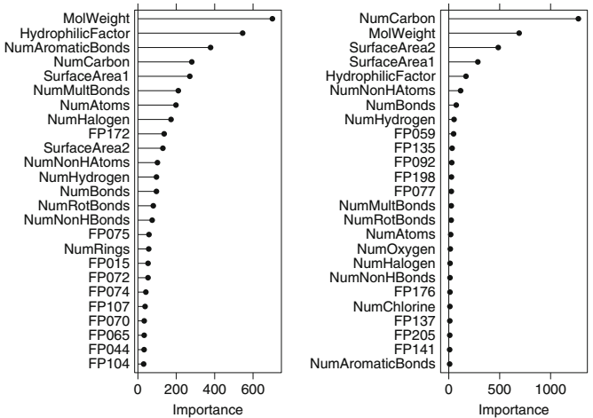

```{r setup, include=FALSE}
knitr::opts_chunk$set(echo = TRUE)
library(caret)
library(tidyr)
library(dplyr)
library(mice)
library(kableExtra)
library(mlbench)
library(DT)
library(tsibble)
library(lubridate)
library(ggplot2)
library(AppliedPredictiveModeling)
library(earth)
library(kernlab)
library(randomForest)
library(Cubist)
library(gbm)
library(ipred)
library(party)
library(partykit)
library(rpart)
library(rpart.plot)
library(RWeka)
library(RColorBrewer)
library(rattle)
library(vip)
```

### Exercise 8.1

Recreate the simulated data from Exercise 7.2:

```{r 8.1Example, eval=TRUE, message=FALSE, warning=FALSE}
set.seed(200)
simulated <- mlbench.friedman1(200, sd = 1)
simulated <- cbind(simulated$x, simulated$y)
simulated <- as.data.frame(simulated)
colnames(simulated)[ncol(simulated)] <- "y"
```


#### (a) Fit a random forest model to all of the predictors, then estimate the variable importance scores:


```{r 8.1A, eval=TRUE, message=FALSE, warning=FALSE}
set.seed(10)
model1 <- randomForest(y ~ ., data = simulated,
                       importance = TRUE,
                       ntree = 1000)
rfImp1 <- varImp(model1, scale = FALSE)

# Print out the variable importance scores.
rfImp1
```

**Did the random forest model significantly use the uninformative predictors (V6 – V10)**?

**Answer:**

_From the above variable importance table we can see that the model significantly utilized variables **V1** through **V5**. Whilst present, Variables **V6** through **V10** were not significantly utilized by the model. This is apparent by their low importance scores **0.17436781 - -0.08529218**_.

\ 

#### (b) Now add an additional predictor that is highly correlated with one of the informative predictors. For example:

```{r 8.1B, eval=TRUE, message=FALSE, warning=FALSE}
simulated$duplicate1 <- simulated$V1 + rnorm(200) * .1
cor(simulated$duplicate1, simulated$V1)
```

**Fit another random forest model to these data. Did the importance score for _V1_ change? What happens when you add another predictor that is also highly correlated with _V1_**?

```{r 8.1BRandomForest, eval=TRUE, message=FALSE, warning=FALSE}
set.seed(10)
model2 <- randomForest(y ~ ., data = simulated,
                       importance = TRUE,
                       ntree = 1000)
rfImp2 <- varImp(model2, scale = FALSE)

# Print out the variable importance scores.
rfImp2
```


**Answer:**

_After adding an additional highly correlated predictor, the importance of variable **V1** dropped significantly - from **8.83890885**, to **6.29780744**_. 


**What happens when you add another predictor that is also highly correlated with _V1_**?

```{r 8.1BRandomForestModel3, eval=TRUE, message=FALSE, warning=FALSE}
set.seed(10)
# Add an additional highly correlated variable.
simulated$duplicate2 <- simulated$V1 + rnorm(200) * .1
cor(simulated$duplicate2, simulated$V1)

# Fit an additional random forest model. 
model3 <- randomForest(y ~ ., data = simulated,
                       importance = TRUE,
                       ntree = 1000)

rfImp3 <- varImp(model3, scale = FALSE)

# Print out the variable importance scores.
rfImp3
```


**Answer:**

_Adding an additional highly correlated variable further reduces the importance of **V1**, but not as dramatically as the reduction after the addition of the previous highly correlated variable_.   

\ 

#### (c) Use the **cforest** function in the party package to fit a random forest model using conditional inference trees. The party package function **varimp** can calculate predictor importance. The **conditional** argument of that function toggles between the traditional importance measure and the modified version described in _Strobl et al. (2007)_. Do these importances show the same pattern as the traditional random forest model?

_**Traditional Importance Measure**_

```{r 8.1C, eval=TRUE, message=FALSE, warning=FALSE}
set.seed(10)
# Fit a random forest model using conditional inference trees.
cforest_model <- cforest(y ~ ., simulated)

# Print out the variable importance scores without conditional argument.
cforestImp3 <- varimp(cforest_model)
cforestImp3
```


_**Conditional Importance Measure**_

```{r 8.1CConditional, eval=TRUE, message=FALSE, warning=FALSE}
# Print out the variable importance scores using conditional argument.
cforestImp3Conditional <- varimp(cforest_model, conditional = TRUE)
cforestImp3Conditional
```


**Answer:**

_The conditional importance measure dramatically decreases the importance of all the variables in the model when compared to the traditional measure_. 

\ 

#### (d) Repeat this process with different tree models, such as boosted trees and Cubist. Does the same pattern occur?

_**Generalized Boosted Model**_

```{r 8.1DBoosted, eval=TRUE, message=FALSE, warning=FALSE}
set.seed(10)
# Fit a Generalized Boosted model.
grid = expand.grid(.interaction.depth = seq(1, 7, by = 2), 
                   .n.trees = seq(100, 1000, by = 50), 
                   .shrinkage = c(0.01, 0.1),
                   .n.minobsinnode = 5)

gbmModel = train(y ~ ., data = simulated, method = 'gbm', tuneGrid = grid, verbose = FALSE)

# Print out the variable importance scores.
gbmImp <- varImp(gbmModel)
gbmImp
```


_**Cubist Model**_

```{r 8.1DCubist, eval=TRUE, message=FALSE, warning=FALSE}
set.seed(10)
# Fit a Cubist model using the cubist() function.
cubistModel <- cubist(simulated[,-11], simulated[, 11])

# Print out the variable importance scores.
cubistImp<-varImp(cubistModel)
cubistImp
```



Fig. 8.24: _A comparison of variable importance magnitudes for differing values of the bagging fraction and shrinkage parameters. Both tuning parameters are set to 0.1 in the _left_ figure. Both are set to 0.9 in the _right_ figure._


### Exercise 8.2

Use a simulation to show tree bias with different granularities.

```{r 8.2, eval=TRUE, message=FALSE, warning=FALSE}
set.seed(10)
# Simulate the data using the twoClassSim() function.
simulation <- twoClassSim(200, noiseVars = 6, corrVar = 4, corrValue = 0.8) %>%
              mutate(TwoFactor1 = as.factor(round(TwoFactor1, 0)),
                     TwoFactor2 = as.factor(round(TwoFactor2, 0)))

# Create the tree and plot the data.
simulationTree <- rpart(Linear01 ~ ., simulation)
fancyRpartPlot(simulationTree, caption = NULL)

# Print out the variable importance scores.
varImp(simulationTree)
```

### Exercise 8.3

In stochastic gradient boosting the bagging fraction and learning rate will govern the construction of the trees as they are guided by the gradient. Although the optimal values of these parameters should be obtained through the tuning process, it is helpful to understand how the magnitudes of these parameters affect magnitudes of variable importance. Figure 8.24 provides the variable importance plots for boosting using two extreme values for the bagging fraction (0.1 and 0.9) and the learning rate (0.1 and 0.9) for the solubility data. The left-hand plot has both parameters set to 0.1, and the right-hand plot has both set to 0.9:


#### (a) Why does the model on the right focus its importance on just the first few of predictors, whereas the model on the left spreads importance across more predictors?

**Answer:**

_The model on the right has a higher learning and bagging rate, which means that a larger percentage of the data is used. Additionally, this results in a larger portion of the current predicted value being added to the previous iterations predicted value. According to the text, "**The importance profile for boosting has a much steeper importance slope than the one for random forests. This is due to the fact that the trees from boosting are dependent on each other and hence will have correlated structures as the method follows by the gradient. Therefore many of the same predictors will be selected across the trees, increasing their contribution to the importance metric**"_. 

#### (b) Which model do you think would be more predictive of other samples?

**Answer:**

_Smaller learning and bagging rates will lead to less variance for new samples so I believe the model on the left would be more predictive of other samples_.

#### (C) How would increasing interaction depth affect the slope of predictor importance for either model in Fig. 8.24?

**Answer:**

_Increasing interaction depth would result in the slope of predictor importance becoming steeper due to the spreading out of importance predictors_.

### Exercise 8.7

Refer to Exercises 6.3 and 7.5 which describe a chemical manufacturing process. Use the same data imputation, data splitting, and pre-processing steps as before and train several tree-based models:

```{r 8.7, eval=TRUE, message=FALSE, warning=FALSE}
set.seed(10)
data(ChemicalManufacturingProcess)

# Impute the missing values using KNN.
cmpImputed <- preProcess(ChemicalManufacturingProcess, 'knnImpute')

# Predict after imputation.
chemicalMPData <- predict(cmpImputed, ChemicalManufacturingProcess)

# Split the training data using an 80% training data split.
trainingData <- createDataPartition(ChemicalManufacturingProcess$Yield, p = 0.8, list = FALSE)
xTrainData <- chemicalMPData[trainingData, ]
yTrainData <- ChemicalManufacturingProcess$Yield[trainingData]

# Split the test data.
xTestData <- chemicalMPData[-trainingData, ]
yTestData <- ChemicalManufacturingProcess$Yield[-trainingData]
```

\ 

**Single Tree Model**

```{r 8.7singleTree, eval=TRUE, message=FALSE, warning=FALSE}
set.seed(10)
# Define the R Part Single Tree model.
rPartSingleTree <- train(x = xTrainData,
                         y = yTrainData,
                         method = 'rpart',
                         tuneLength = 10,
                         trControl = trainControl(method = 'cv'))

# Run predict() and postResample() on the model.
rPartSingleTreePred <- predict(rPartSingleTree, newdata = xTestData)
rPartSingleTreePerformance <- postResample(pred = rPartSingleTreePred, obs = yTestData)
rPartSingleTreePerformance
```

\ 

**Random Forest Model**

```{r 8.7randomForest, eval=TRUE, message=FALSE, warning=FALSE}
set.seed(10)
# Define the Random Forest model.
randomForest <- train(x = xTrainData,
                      y = yTrainData,
                      method = 'rf',
                      tuneLength = 10,
                      importance = TRUE,
                      trControl = trainControl(method = 'cv'))

# Run predict() and postResample() on the model.
randomForestPred <- predict(randomForest, newdata = xTestData)
randomForestPerformance <- postResample(pred = randomForestPred, obs = yTestData)
randomForestPerformance
```

\ 

**GBM Model**

```{r 8.7GBM, eval=TRUE, message=FALSE, warning=FALSE}
set.seed(10)

# Define the GBM model.
grid <- expand.grid(interaction.depth = seq(1, 6, by = 1),
                    n.trees = c(25, 50, 100, 200),
                    shrinkage = c(0.01, 0.05, 0.1, 0.2),
                    n.minobsinnode = c(5, 10, 15))

gbmModel <- train(x = xTrainData,
                  y = yTrainData,
                  method = 'gbm',
                  tuneGrid = grid,
                  trControl = trainControl(method = 'cv'),
                  verbose = FALSE)

# Run predict() and postResample() on the model.
gbmModelPred <- predict(gbmModel, newdata = xTestData)
gbmModelPerformance <- postResample(pred = gbmModelPred, obs = yTestData)
gbmModelPerformance
```

\ 

#### (a) Which tree-based regression model gives the optimal resampling and test set performance?

```{r 7.5ModelPerforamnceComparison, eval=TRUE, message=FALSE, warning=FALSE}
rbind('Single Tree Model' = rPartSingleTreePerformance,
      'Random Forest Model' = randomForestPerformance,
      'GBM Model' = gbmModelPerformance) %>%
kable() %>% kable_styling()
```

**Answer:**

Based on the lowest **RMSE** value and the highest **Rsquared** value, the **Random Forest** model gives the optimal resampling and test set performance.

\ 

#### (b) Which predictors are most important in the optimal tree-based regression model? Do either the biological or process variables dominate the list? How do the top 10 important predictors compare to the top 10 predictors from the optimal linear and nonlinear models?

**Which predictors are most important in the optimal tree-based regression model? Do either the biological or process variables dominate the list?**

```{r 7.5B, eval=TRUE, message=FALSE, warning=FALSE}
varImp(randomForest)
vip(randomForest, aesthetics = list(color = 'red', fill='green'))
```


**Answer:**

_The most important predictors in the optimal tree-based regression model (_Random Forest_) are shown above. As we can see, the process variables dominate the list_.


**How do the top 10 important predictors compare to the top 10 predictors from the optimal linear and nonlinear models?**

```{r 7.5BOtherModels, eval=TRUE, message=FALSE, warning=FALSE}
# Define and tune the SVM model.
svmModel <- train(x = xTrainData,
                  y = yTrainData,
                  method = 'svmRadial',
                  preProc = c('center', 'scale'),
                  tuneLength = 14,
                  trControl = trainControl(method = 'cv'))

varImp(svmModel)
vip(svmModel, aesthetics = list(color = 'red', fill='purple'))
```


**Answer:**

_From the previous homework on linear and non linear models, the SVM model was found to be the optimal model. As we can see from the above, the process variables dominate the list the same way they do for the Random Forest model_.

\ 

#### (c) Plot the optimal single tree with the distribution of yield in the terminal nodes. Does this view of the data provide additional knowledge about the biological or process predictors and their relationship with yield?


```{r 7.5C, eval=TRUE, message=FALSE, warning=FALSE}
rpartTree <- rpart(Yield ~., data = xTrainData)
fancyRpartPlot(rpartTree, caption = 'Distribution of Yield')
```

**Answer:**

The above tree diagram does provide additional knowledge about the biological or process predictors and their relationship with yield. The diagram shows us the importance of each of the variables. The higher up the tree, the more important the variable is. This helps us to determine which variables are influential in improving yield.
